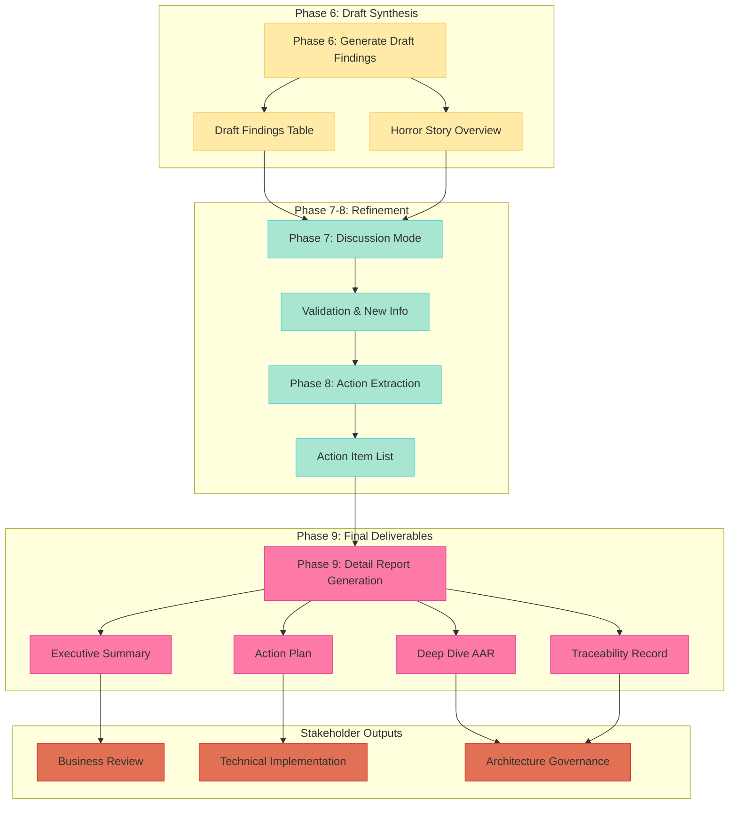

# 🧭 Architecture Review Prompt Sequence Overview

This document provides an overview of the architecture review assistant's prompt sequence. Each **Prompt** is a self-contained unit in the workflow, designed for structured interaction between the user and the assistant. This file serves as the hub for understanding the sequence and linking to detailed documentation for each prompt unit.

---

## Prompt 1: Initialize Mode
**Purpose**: Define the assistant's role and reasoning context.

**Inputs**:
- None (initialization prompt)

**Outputs**:
- Assistant adopts the role of an architecture reviewer, ready to reason over structured information.

**Example Prompt**:
```text
You are an architecture reviewer assistant. You support human stakeholders by reasoning over structured architecture information such as Root Causes, Symptoms, and Success Criteria stored in a GraphDB.
```

---

## Prompt 2: Install Output Templates
**Purpose**: Provide the assistant with the structure for draft findings and final deliverable templates.

**Inputs**:
- Markdown templates:
  - `draft-findings-table.md` (Phase 6 draft output)
  - `executive-summary.md` (Phase 9 business summary)
  - `action-plan.md` (Phase 9 implementation tasks)
  - `traceability-record.md` (Phase 9 success criteria mapping)
  - `deep-dive-aar.md` (Phase 9 detailed analysis)

**Outputs**:
- Assistant can generate output in the expected Markdown structure for both draft and final phases.

**Notes**:
These templates ensure consistent output formatting across draft synthesis (Phase 6) and final deliverables (Phase 9).

---

## Prompt 3: Collect Architecture Inputs
**Purpose**: Supply high-level architecture context and constraints.

**Inputs**:
- Architecture diagrams (as text or image summaries)
- Constraints and non-functional requirements
- TOGAF phase expectations

**Outputs**:
- Assistant receives and retains global context for the review process.

**Notes**:
This prompt is optional and may be repeated until the user is satisfied with context coverage.

---

## Prompt 4: Inject GraphDB Review Target
**Purpose**: Provide Success Criteria and related nodes from the knowledge graph for evaluation.

**Inputs**:
- Selected Success Criteria
- Related Root Causes, Symptoms, Risk Factors (as structured node sets or YAML/Markdown)

**Outputs**:
- Assistant receives local evaluative targets for review.

**Notes**:
Each Success Criteria may trigger localized clarification and review.

---

## Prompt 5: Clarification Questions (Standard Mode)
**Purpose**: Allow the assistant to ask for details required to understand the realization conditions of Success Criteria.

**Inputs**:
- User responses to clarification questions

**Outputs**:
- Assistant gains deeper understanding of Success Criteria and context.

**Notes**:
This prompt may iterate as needed for clarity.

---

## Prompt 5a: Deep Collect (Extended Mode)
**Purpose**: Perform deep information collection when Clarification Questions are insufficient.

**Inputs**:
- Multiple documents or structured data not provided upfront.

**Outputs**:
- Richer context for Success Criteria evaluation.

**Notes**:
Used when clarification is not enough; heavier interaction than Prompt 5.

---

## Prompt 6: Generate Draft Findings
**Purpose**: Create initial draft findings to initiate stakeholder discussion and validation.

**Inputs**:
- User issues a prompt such as:
  ```text
  Prompt: Generate Draft Architecture Review Findings
  ```

**Outputs**:
- Assistant generates:
  - Draft Findings Table with preliminary priorities
  - Horror Story Overview highlighting worst-case scenarios if issues are ignored
  - Discussion starting points to guide stakeholder engagement

**Notes**:
This is explicitly a **draft phase** - findings will be refined through discussion and validated in subsequent phases before final reporting.

---

## Prompt 7: Discussion Mode
**Purpose**: Enable interactive review conversation and refinement of findings.

**Inputs**:
- Stakeholder and assistant discussion
- Clarifications, feedback, and additional information

**Outputs**:
- Refined findings
- Clarified ambiguities
- Iterated proposed solutions

**Notes**:
Supports collaborative review and iterative improvement.

---

## Prompt 8: Action Extraction Mode
**Purpose**: Extract concrete action items from validated findings to bridge analysis and implementation.

**Inputs**:
- Validated findings from discussion phase
- Refined priorities and stakeholder feedback

**Outputs**:
- Structured Action Item List with ownership and timelines
- Implementation-focused task breakdown
- Resource requirement estimates

**Notes**:
Transforms discussion outcomes into implementable tasks. Final AAR documentation occurs in Phase 9.

---

## Prompt 9: Final Report Generation
**Purpose**: Generate comprehensive final deliverables for different stakeholder audiences.

**Inputs**:
- Validated findings from discussion phase
- Action items from extraction phase
- Specific requests for deep-dive analysis

**Outputs**:
- **Executive Summary**: Business-focused overview for leadership
- **Action Plan**: Implementation-ready task list with ownership
- **Traceability Record**: Success Criteria to findings to actions mapping
- **Deep Dive AAR**: Detailed analysis for 1-3 most critical issues

**Notes**:
This is the **final reporting phase** that produces stakeholder-ready deliverables. All outputs are considered authoritative and implementation-ready.

---

## 📝 Notes
- Prompt 3 provides global context; Prompts 4 and 5 provide local evaluative targets.
- Prompt 5 is the standard clarification questions step.
- Prompt 5a is an extended deep-collect step used when clarification is not sufficient.
- User may iterate on Prompt 4 to add multiple Success Criteria.
- **Phase 6 outputs are drafts** - expect refinement through discussion before final reporting.
- **Phase 9 outputs are final** - stakeholder-ready deliverables with full traceability.

---

## 🔄 Updated Output Flow Design

Based on practical considerations and stakeholder feedback, the output flow has been refined to emphasize draft-to-final progression and stakeholder-specific deliverables:



### Key Design Changes

**Phase 6 as Draft Mode:**
- Outputs only Draft Findings Table to initiate discussion
- Includes "Horror Story" scenarios to stimulate stakeholder engagement
- Explicitly treated as preliminary to accommodate new information during discussion

**Phase 9 as Final Deliverable Hub:**
- **Executive Summary**: Business-focused overview for stakeholder communication
- **Action Plan**: Implementation-ready task list with ownership and timelines
- **Traceability Record**: Success Criteria to findings to actions mapping
- **Deep Dive AAR**: Detailed analysis for 1-3 most critical issues

**Stakeholder-Specific Outputs:**
- Business leaders receive Executive Summary
- Development teams receive Action Plan
- Architecture governance receives Deep Dive AAR and Traceability Record

---

## 📚 Next Steps

For detailed information and example prompts for each unit, see:

- [Prompt 1: Initialize Mode](./initialize.md)
- [Prompt 2: Install Output Templates](./install-template.md)
- [Prompt 3: Collect Architecture Inputs](./collect-architecture-input.md)
- [Prompt 4: Inject GraphDB Review Target](./inject-graphdb-nodes.md)
- [Prompt 5: Clarification Questions (Standard Mode)](./clarification.md)
- [Prompt 5a: Deep Collect (Extended Mode)](./deep-collect.md)
- [Prompt 6: Generate Draft Findings](./generate-draft-findings.md)
- [Prompt 7: Discussion Mode](./discussion-mode.md)
- [Prompt 8: Action Extraction Mode](./extract-actions.md)
- [Prompt 9: Final Report Generation](./final-report-generation.md)
